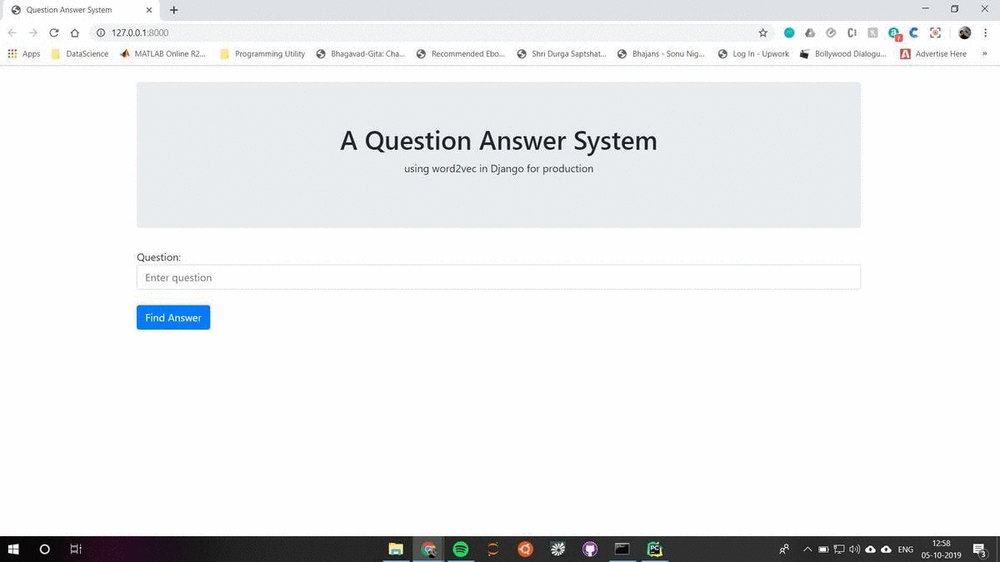

<div style="text-align: center">
    <h1 style="color:#888888">TUTORIAL</h1>
    <hr>
    <h1>A Production ready Question Answer(QnA) Application</h1>
    <p style="color:#888888; text-align: center;font-size:14pt;">in django framework using word2vec</p>
</div>
<hr>
<div style="text-align: center">
<i class="fa fa-user" aria-hidden="true"></i> &nbsp; By Rahul Kumar Sinha |&nbsp;
<i class="fa fa-clock-o" aria-hidden="true"></i> &nbsp; 20 minutes read |&nbsp;
<i class="fa fa-calendar" aria-hidden="true"></i> &nbsp; 04/10/2019
</div>

 

 

<h1>Table of Contents<span class="tocSkip"></span></h1>
<div class="toc"><ul class="toc-item"><li><span><a href="#Introduction" data-toc-modified-id="Introduction-1">Introduction</a></span></li><li><span><a href="#Installation" data-toc-modified-id="Installation-2">Installation</a></span></li><li><span><a href="#Create-and-Configure-Django-project" data-toc-modified-id="Create-and-Configure-Django-project-3">Create and Configure Django project</a></span></li><li><span><a href="#Create-Models" data-toc-modified-id="Create-Models-4">Create Models</a></span></li><li><span><a href="#Registering-Models-to-Admin" data-toc-modified-id="Registering-Models-to-Admin-5">Registering Models to Admin</a></span></li><li><span><a href="#Word2Vec-using-pymagintude" data-toc-modified-id="Word2Vec-using-pymagintude-6">Word2Vec using pymagintude</a></span></li><li><span><a href="#Update-Models-and-Admin" data-toc-modified-id="Update-Models-and-Admin-7">Update Models and Admin</a></span></li><li><span><a href="#Creating-Views" data-toc-modified-id="Creating-Views-8">Creating Views</a></span></li><li><span><a href="#Django-Template-Engine-Setup" data-toc-modified-id="Django-Template-Engine-Setup-9">Django Template Engine Setup</a></span></li><li><span><a href="#-Update-Views-for-POST-Call" data-toc-modified-id="-Update-Views-for-POST-Call-10">Update Views for POST Call</a></span></li><li><span><a href="#-Update-Utilities-" data-toc-modified-id="-Update-Utilities--11">Update Utilities </a></span></li><li><span><a href="#-Create-Super-User-" data-toc-modified-id="-Create-Super-User--12">Create Super User </a></span></li><li><span><a href="#-Lets-run-the-code-" data-toc-modified-id="-Lets-run-the-code--13">Lets run the code </a></span></li></ul></div>

<div style="font-size:14pt;line-height: 20pt;">
<h3>Introduction</h3>
<hr>
In this tutorial, we are going to create a question-answer application, where the question asked by the user will be matched with all the questions from the database using vector cosine similarity.
    <br><br>
And the answer related to the most similar found question from the database will be returned to the user. <br>
Also, an admin will have the option to add more question answers to the database.
<br><br>
In this tutorial, we will be using the python package "magnitude".<br>
It is intended to be a simpler and faster alternative to current utilities for word vectors like Gensim.

Loading the binary files containing the word vectors takes Gensim 70 seconds, versus 0.72 seconds to load the corresponding Magnitude file, a 97x speed-up. Gensim uses 5GB of RAM versus 18KB for Magnitude.<br>
Hence it is ideal to be used in production.
<br><br>
Below is a view of the final application that will be created by the end of this tutorial.<br>
(Left - User View | Right - Admin View )
</div>


<div style="font-size:14pt;line-height: 20pt;">
<h3>Installation</h3>
<hr>
The first we need to do is a basic setup for our project which includes

- Creating a folder in which our code will reside.<br>
     ```mkdir myproject```<br>
     ```cd myproject```<br><br>
- Creating Virtual Environment (Using virtual environments is not mandatory, but it’s highly recommended)
    ```virtualenv venv```<br><br>
- Activating Virtual Environment.<br>
    ```venv\Scripts\activate``` in windows<br>
    ```source venv/bin/activate``` in linux/mac<br><br>
<em>Note: Enviroment can be deactivated using ```venv\Scripts\deactivate.bat``` or ```source venv/bin/deactivate```</em><br><br>
- Installing required packages.<br>
    ```pip install django pandas numpy pymagnitude django-pandas```<br><br>
<div>

<div style="font-size:14pt;line-height: 20pt;">
<h3>Create and Configure Django project</h3>
<hr>

To create a Django project, run the  command below:<br>
```django-admin startproject myproject .```  
<em> Note: "." in the above the command, instruct Django to create files in the current folder.</em><br>  
Next we need to create an app, execute the below command:<br>
```python manage.py startapp myapp```

Now that we created our first app, let’s configure our project to use it.  
To do that, open the settings.py and try to find the INSTALLED_APPS variable and add our "myapp" app to the list.
<pre style="background-color:#EEEEEE">
INSTALLED_APPS = [
    'django.contrib.admin',
    'django.contrib.auth',
    'django.contrib.contenttypes',
    'django.contrib.sessions',
    'django.contrib.messages',
    'django.contrib.staticfiles',
    'myapp',
]
</pre>
</div>

<div style="font-size:14pt;line-height: 20pt;">
<h3>Create Models</h3>
<hr>

We will be creating QuenstionAnswer model that will store the questions, answers and question vectors in our database.

Open the models.py file inside the myapp, and add the following code:

<b>models.py</b>
<pre style="background-color:#EEEEEE">
from django.db import models

class QuestionAnswer(models.Model):
    question = models.CharField(max_length=500)
    question_vector = models.BinaryField(blank=True)
    answer = models.TextField()
    
    class Meta:
        verbose_name_plural = 'QuestionAnswers'
</pre>

The inner class Meta, is way to provide metadata to your models.

It is “anything that’s not a field”, such as ordering options (ordering), database table name (db_table), or human-readable singular and plural names (verbose_name and verbose_name_plural).

A complete list of all possible Meta options can be found in the [model option reference](https://docs.djangoproject.com/en/2.2/topics/db/models/#meta-options).

Now we need to make and run migration so that Django creates our models in the database.

Run the below command:
<pre style="background-color:#EEEEEE">
python manage.py makemigrations
python manage.py migrate
</pre>

And its time to register the model.
</div>

<div style="font-size:14pt;line-height: 20pt;">
<h3>Registering Models to Admin</h3>
<hr>

We will use Django Admin for CURD  operations on our QuestionAnswer model.
To do so we need to register our model in admin panel.

Hence open the admin.py file inside the myapp, and add the following code:

<b>admin.py</b>
<pre style="background-color:#EEEEEE">
from django.contrib import admin
from core.models import QuestionAnswers


@admin.register(QuestionAnswers)
class QuestionAnswersAdmin(admin.ModelAdmin):
    list_display = ['question', 'answer']

</pre>
</div>

<div style="font-size:14pt;line-height: 20pt;">
<h3>Word2Vec using pymagintude</h3>
<hr>

In this section, we will be creating a function that will convert text to vectors. We will use this function to convert all questions to vectors and save them as bytes.


To do so, we will be using the pymagnitude module.

First, let's download a glove 6b 300d, word2vec model from the [pymagnitude link](http://magnitude.plasticity.ai/glove/light/glove.6B.300d.magnitude).

And save the magnitude file in new folder "resources" under myproject, at the same level as manage.py.

Now, create a python file "utilities.py"  inside the myapp folder.
And add the following code.

<b>utilities.py</b>
<pre style="background-color:#EEEEEE">

import numpy as np
from pymagnitude import Magnitude
from string import punctuation
from resources.stopwords import STOPWORDS


model = Magnitude("./resources/glove.6B.300d.magnitude")


def text_to_vector(text):
    clean_text = text.translate(str.maketrans("","", punctuation))
    clean_tokens = [t.lower() for t in clean_text.split() if t not in STOPWORDS]
    text_vector = np.sum(model.query(clean_tokens), axis=0)
    return text_vector

</pre>
</div>

<div style="font-size:14pt;line-height: 20pt;">
In the "text_to_vector" function, we are pre-processing the input text by removing all the punctuation and stopwords.
This helps in noise removal from the text. Then we query the model to fetch vectors for each word, and column-wise add all the vectors to form a sentence vector.

To normalize the vector, irrespective of sentence length, we average the vector by the number of tokens in the sentence.

And last, we return the final sentence vector.


Also, create a file "stopwords.py" inside the "resources" folder and add the list of stopwords provided by NLTK.<br><br>
<b>stopwords.py</b>

<pre style="background-color:#EEEEEE">
STOPWORDS = {'ourselves', 'hers', 'between', 'yourself', 'but', 'again', 'there', 'about', 'once', 'during', 'out', 'very', 'having', 'with', 'they', 'own', 'an', 'be', 'some', 'for', 'do', 'its', 'yours', 'such', 'into', 'of', 'most', 'itself', 'other', 'off', 'is', 's', 'am', 'or', 'who', 'as', 'from', 'him', 'each', 'the', 'themselves', 'until', 'below', 'are', 'we', 'these', 'your', 'his', 'through', 'don', 'nor', 'me', 'were', 'her', 'more', 'himself', 'this', 'down', 'should', 'our', 'their', 'while', 'above', 'both', 'up', 'to', 'ours', 'had', 'she', 'all', 'no', 'when', 'at', 'any', 'before', 'them', 'same', 'and', 'been', 'have', 'in', 'will', 'on', 'does', 'yourselves', 'then', 'that', 'because', 'what', 'over', 'why', 'so', 'can', 'did', 'not', 'now', 'under', 'he', 'you', 'herself', 'has', 'just', 'where', 'too', 'only', 'myself', 'which', 'those', 'i', 'after', 'few', 'whom', 't', 'being', 'if', 'theirs', 'my', 'against', 'a', 'by', 'doing', 'it', 'how', 'further', 'was', 'here', 'than'}

</pre>
</div>

<div style="font-size:14pt;line-height: 20pt;">
<h3>Update Models and Admin</h3>
<hr>

Add the save method in our model class.

In this method will convert question(text) to vectors(numpy array).
And will save vectors as bytes in the database.

<b>models.py</b>
<pre style="background-color:#EEEEEE">

import numpy as np                           # < -- Here
from django.db import models
from core.utilities import text_to_vector    # < -- Here


class QuestionAnswers(models.Model):
    question = models.CharField(max_length=500)
    question_vector = models.BinaryField(blank=True)
    answer = models.TextField()

    def save(self, *args, **kwargs):          # < --  Here
        self.question_vector = text_to_vector(self.question).tobytes()
        response = super(QuestionAnswers, self).save(*args, **kwargs)
        return response

    def vector_size(self):                   # < --  And here
        if self.question_vector:
            vector = np.frombuffer(self.question_vector, dtype='float32')
            return str(len(vector))
        else:
            return "0"

    class Meta:
        verbose_name_plural = 'QuestionAnswers'
        
</pre>


The vector_size method returns the length of vectors saved in the database.

We will add this to the admin view.

<b>admin.py</b>
<pre style="background-color:#EEEEEE">

from django.contrib import admin
from core.models import QuestionAnswers


@admin.register(QuestionAnswers)
class QuestionAnswersAdmin(admin.ModelAdmin):
    list_display = ['question', 'answer', 'vector_size']  # < -- Here
    
</pre>

</div>

<div style="font-size:14pt;line-height: 20pt;">
<h3>Creating Views</h3>
<hr>

Let's write our view that will handle the User requests.

<b>views.py</b>

<pre style="background-color:#EEEEEE">

from django.shortcuts import render
from django.views.decorators.csrf import csrf_exempt


@csrf_exempt
def default(request):

    if request.method == 'GET':
        return render(request, 'index.html')</pre>
        
</pre>

Now we have to tell Django when to serve this view. It’s done inside the urls.py file

<b>urls.py</b>
<pre style="background-color:#EEEEEE">

from django.contrib import admin
from django.urls import path, include
import core.views as core_views

urlpatterns = [
    path('admin/', admin.site.urls),
    path('', core_views.default, name="default"),   # < -- Here
]

</pre>
</div>

<div style="font-size:14pt;line-height: 20pt;">
<h3>Django Template Engine Setup</h3>
<hr>

In the above view function, we are sending index.html as a response for the user request.  
We are using Django Template Engine to perform this.

Create a new folder named templates alongside with the myapp and resources folders.

Now within the templates folder, create an HTML file named index.html

<b>templates/index.html</b>
</div>
<!DOCTYPE html>
<html lang="en">

<head>

    <!-- Required meta tags -->
    <meta charset="utf-8">
    <meta name="viewport" content="width=device-width, initial-scale=1, shrink-to-fit=no">
    
    <!-- Bootstrap CSS -->
    <link rel="stylesheet" href="https://stackpath.bootstrapcdn.com/bootstrap/4.3.1/css/bootstrap.min.css" integrity="sha384-ggOyR0iXCbMQv3Xipma34MD+dH/1fQ784/j6cY/iJTQUOhcWr7x9JvoRxT2MZw1T" crossorigin="anonymous">
    
    <title>Question Answer System</title>

</head>

<body class="container">
<br>

<header class="jumbotron text-center">
    <h1>A Question Answer System</h1>
    <p>using word2vec in Django for production</p>
</header>

<form method="post" class="form-horizontal">
    Question:
    <input type="text" name="text" class="form-control" placeholder="Enter question">
    <br>
    <button type="submit" class="btn btn-primary">Find Answer</button>
</form>


    <hr>
    <strong>Q: </strong>{{ question }}
    <br>
    <strong>Ans: </strong>{{ answer }}

</body>
</html>
<div style="font-size:14pt;line-height: 20pt;">
In the example above we are mixing raw HTML with some special tags  and {{ variable }}.
  
They are part of the Django Template Language. The example above shows if the answer variable is available then display the value of variable stored in question and answer.

In the above form when the user submits a question, it will be sent to same url with the post method.


<h3>Update Views for POST Call</h3>
<hr><br>
Let's update our views.py code to handle post request.

<b>views.py</b>

<pre style="background-color:#EEEEEE">

from core.utilities import get_answer     # < -- Here
from core.models import QuestionAnswers   # < -- Here
from django.shortcuts import render
from django.views.decorators.csrf import csrf_exempt


@csrf_exempt
def default(request):

    if request.method == 'GET':
        return render(request, 'index.html')

    elif request.method == 'POST':        # < -- And here
        text = request.POST.get("text", None)

        if text is None:
            return render(request, 'index.html',{"question":text, "answer":'Bad Query'})

        else:
            qna_qs = QuestionAnswers.objects.all()
            answer = get_answer(text, qna_qs)
            return render(request, 'index.html', {"question": text, "answer": answer})
            
</pre>
</div>

<div style="font-size:14pt;line-height: 20pt;">
In above post method, we save user question in a variable called text. And then fetch all the question answers available in our database.

The get_answer function, find the best match of user question from the database and returns the answer.

Let us write the get_answer function in utilities.py.

<h3>Update Utilities </h3>
<hr><br>
<b>utilities.py</b>

</dvi>
import numpy as np
from pymagnitude import Magnitude
from numpy.linalg import norm
from string import punctuation
from django_pandas.io import read_frame
from resources.stopwords import STOPWORDS


model = Magnitude("./resources/glove.6B.300d.magnitude")


def cosine_similarity(vector_1, vector_2):
    return np.inner(vector_1, vector_2) / (norm(vector_1) * norm(vector_2))


def text_to_vector(text):
    clean_text = text.translate(str.maketrans("","", punctuation))
    clean_tokens = [t.lower() for t in clean_text.split() if t not in STOPWORDS]
    text_vector = np.sum(model.query(clean_tokens), axis=0)
    return text_vector


def get_answer(text, qna_qs):
    text_vector = text_to_vector(text)
    qna_df = read_frame(qna_qs)
    qna_df['vectors'] = qna_df['question_vector'].apply(lambda x: np.frombuffer(x, dtype='float32'))
    qna_df['cosine_similarity'] = qna_df['vectors'].apply(lambda x: cosine_similarity(x, text_vector))
    max_match = qna_df[qna_df.cosine_similarity == qna_df.cosine_similarity.max()]

    if (max_match['cosine_distance'] >= 0.6).bool():
        print(max_match['answer'])
        answer = max_match['answer'].iloc[0]
    else:
        answer = "I dont have answer for this question"
    return answer
<div style="font-size:14pt;line-height: 20pt;">

In the above get_answer function we convert text to vector.  
Then, we convert all the database questions from Django query-set format to the panda's data frame format. 

We also convert question_vectors from bytes to numpy arrays and add them in a new column called vectors.  
Now we calculate the cosine similarity between every question in the database and the user text using vectors and text_vectors.

Finally, we find the row with the maximum similarity.  
And if the similarity is greater than the threshold value of 60% then return the respective answer.

<h3>Create Super User </h3>
<hr>

For logining into admin, we neeed to create super user.
Execute the following command:

<pre style="background-color:#EEEEEE">

  python manage.py createsuperuser

</pre>
</dvi>

<div style="font-size:14pt;line-height: 20pt;">
<h3>Lets run the code </h3>
<hr>
Now we are ready to test our code. Run the below command to start the server

<pre style="background-color:#EEEEEE">

  python manage.py runserver

</pre>
   
Open http://127.0.0.1:8000/admin in your browser and login using super user credentials.

Add Question Answers in QuestionAnswers model and save. 


Now go to http://127.0.0.1:8000  and ask question.



</dvi>
